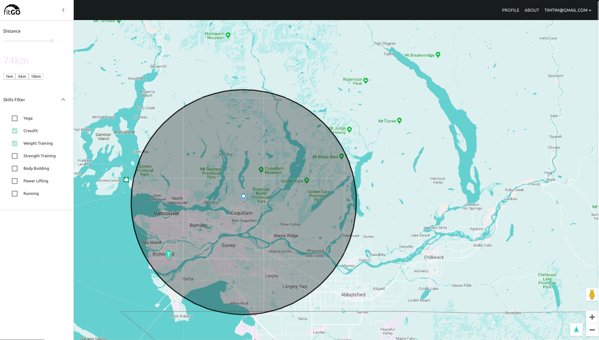

# FitGO

FitGO is a web application that gives users more convenient access to personal trainers nearby. The main feature of the application is a map that will help users filter personal trainers by distance and by skills. Users will see personal trainers' information and can favour the trainers. Personal trainers have a profile page where they can see a list of users that have favored them.

## Authors

- Steve Choi | [Github](https://github.com/stevechoiio)
- Jennifer Lam | [Github](https://github.com/agalcalledjen)
- Tim Nguyen | [Github](https://github.com/timng93)

## Screenshots

### Welcome Screen

### Featured Page

## Technologies Used

`Back-end Development`:

- Meteor.js
- MongoDB
- SimpleSchema
- Node.js

`Front-end Development`:

- Meteor.js
- React.js
- Material-UI

## Installation Instructions

Install
`meteor npm install`

Front-End Development
`meteor`

Back-End Database
`meteor mongo`

## Reflections

The three of us learned a lot about Meteor as a full-stack developer tool. Using React, MongoDB, Meteor, and other technologies, we learned the whole process of building a viable product front-end and back-end in a short amount of time.
